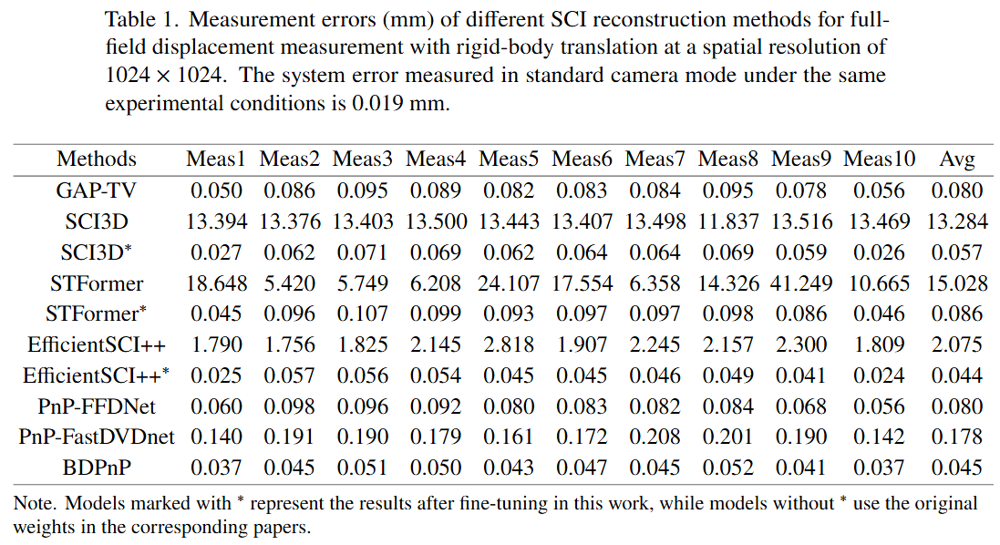
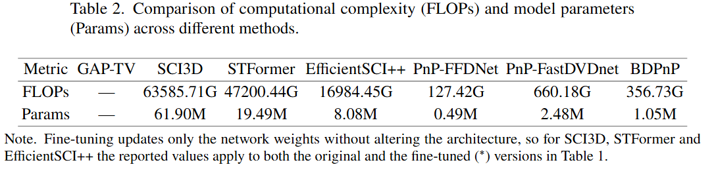
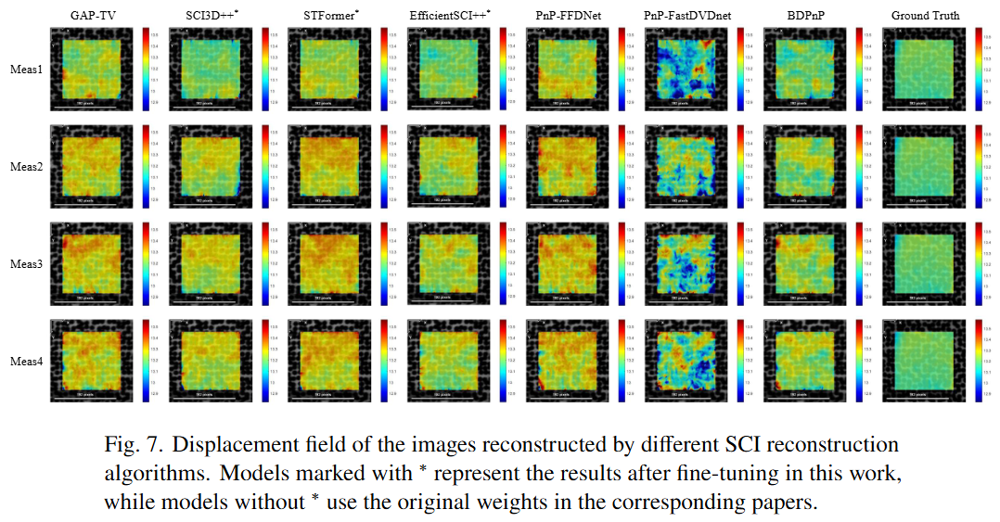

# [Binary Deep Prior Guided Video Snapshot Compressive Imaging for Full-Field Displacement Measurement](https://github.com/hnu-VML/qmx/tree/main/BDPnP)

## Binary Deep Prior
<div align="center">
    
  
  Fig3. Architecture of the proposed BiFastDVDnet.
</div>

<div align="center">
  <table>
    <tr>
      <td>
        
        <p align="center">(a) Regularization Binary Convolution Unit.</p>
      </td>
      <td>
        
        <p align="center">(b) Forward and Backward.</p>
      </td>
    </tr>
  </table>
  Fig4. The network architecture of the proposed Regularized Binary Convolution Unit.
</div>

## 1. Installation
Please see the [environment](environment.yml) for BDPnP Installation. 
```
conda env create -f environment.yml
```

## 2. SCI Reconstruction
```
cd ./1_Reconstruction_Algorithm/
python main.py
```


## 3. Full-field Displacement Measurement

#### 3.1 Calibration

Enter the [1_calibration](2_Full_field_Displacement_Measurement/1_calibration) folder and use the MATLAB toolbox to calibrate the camera parameters, then save them as [cameraParams.mat](2_Full_field_Displacement_Measurement/1_calibration/cameraParams.mat).

#### 3.2 Data processing

Enter the [2_data_processing](2_Full_field_Displacement_Measurement/2_data_processing) folder, place the reconstruction images into the **data** folder, and run the .m files to transform the images from the camera coordinate system to the tablet coordinate system. The transformed images will be saved in the **resize_data** folder.
```
undistortedimg.m
resize_result.m
```

#### 3.3 DIC measurement and compute displacement error

We use the [Ncorr algorithm](https://www.ncorr.com/) to calculate the displacement field of the reconstructed speckle image sequence (In resize_data) and save the results in the [2_Full_field_Displacement_Measurement/3_DIC-Result](2_Full_field_Displacement_Measurement/3_DIC-Result) folder. Finally, navigate to the [2_Full_field_Displacement_Measurement](2_Full_field_Displacement_Measurement) directory and run the following .m files.
```
compute_error.m
```
The computed displacement errors and corresponding displacement field visualization are illustrated in the figures below.
<div align="center">
    
</div>
<div align="center">
    
  </div>
<div align="center">
    
</div>