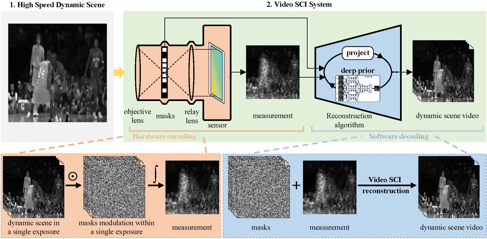
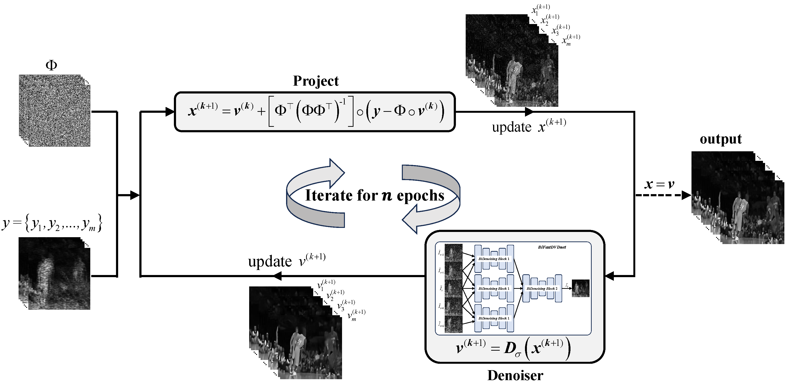
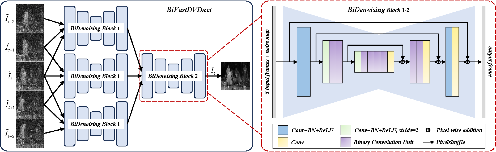
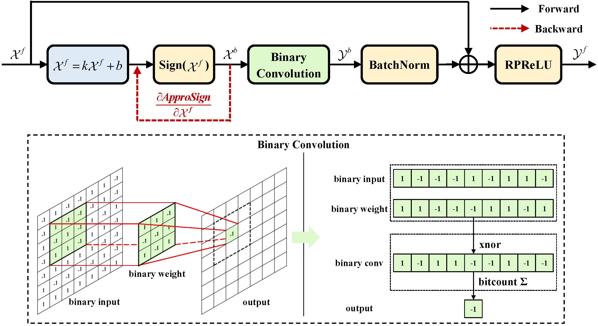
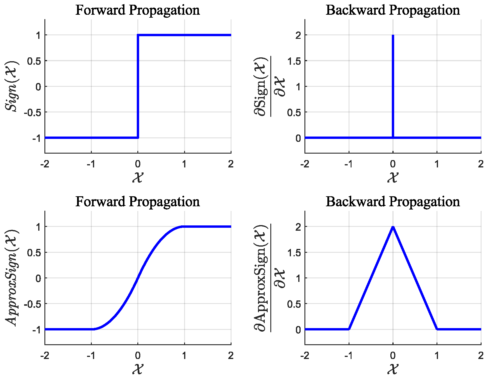
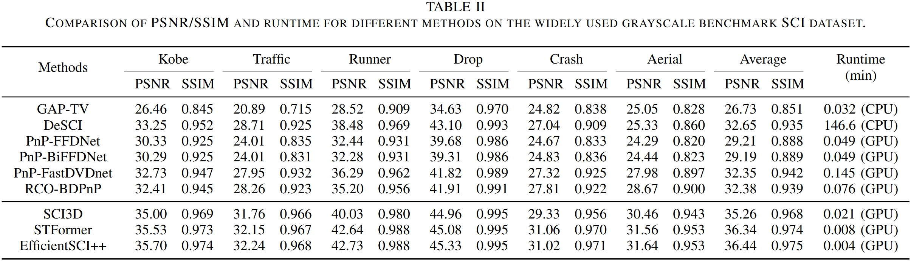
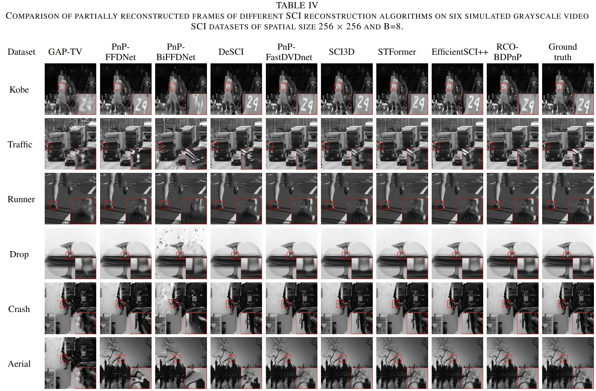
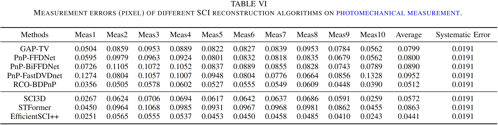
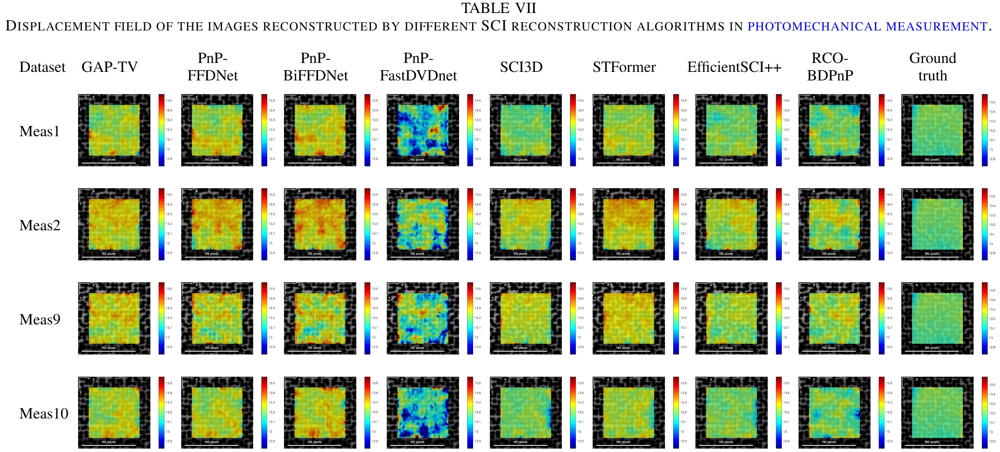

# [Efficient and Robust Plug-and-Play Algorithm for Video Snapshot Compressive Imaging and Photomechanical Measurement](https://github.com/Qinmengxi/EfficientPnP)

## Network Architecture
<div align="center">
    
  
  Fig1. Schematic diagrams of video SCI system. The orange part represents hardware encoding, and the blue part denotes software decoding (implemented via PnP-based methods).
</div>

<div align="center">
    
  
  Fig2. Schematic diagrams of efficient binary deep plug-and-play algorithm with collaborative optimization for robust video SCI and applications.
</div>

<div align="center">
    
  
  Fig3. Architecture of the proposed BiFastDVDnet.
</div>

<div align="center">
  <table>
    <tr>
      <td>
        
        <p align="center">(a) Binary Convolution Unit Module.</p>
      </td>
      <td>
        
        <p align="center">(b) Forward and Backward.</p>
      </td>
    </tr>
  </table>
  Fig4. The network architecture of the proposed Regularized Binary Convolution Unit.
</div>

## 1. Installation
Please see the [environment](environment.yml) for RCO-BDPnP Installation. 
```
conda env create -f environment.yml
```

## 2. SCI Reconstruction
```
cd ./1_PnP_Algorithm/
python main_grayscale_benchmark.py
```

The reconstruction quality on six simulated grayscale video SCI datasets is reported in Table II and Table Ⅳ.
<div align="center">
    
</div>
<div align="center">
    
</div>


## 3. Photomechanical_Measurement
#### 3.1 Reconstruction on  photomechanical measurement
Navigate to the [1_PnP_Algorithm](1_PnP_Algorithm) folder and run [main_real_photomechanical_imaging.py](1_PnP_Algorithm/main_real_photomechanical_imaging.py) to obtain the reconstructed speckle image sequence
```
cd ./1_PnP_Algorithm/
python main_real_photomechanical_imaging.py
```

#### 3.2 Calibration

Enter the [1_calibration](2_Photomechanical_Measurement/1_calibration) folder and use the MATLAB toolbox to calibrate the camera parameters, then save them as [cameraParams.mat](2_Photomechanical_Measurement/1_calibration/cameraParams.mat).

#### 3.3 Data processing

Enter the [2_data_processing](2_Photomechanical_Measurement/2_data_processing) folder, place the reconstruction images into the **data** folder, and run the .m files to transform the images from the camera coordinate system to the tablet coordinate system. The transformed images will be saved in the **resize_data** folder.
```
undistortedimg.m
resize_result.m
```

#### 3.4 DIC measurement and compute displacement error

We use the [Ncorr algorithm](https://www.ncorr.com/) to calculate the displacement field of the reconstructed speckle image sequence (In resize_data) and save the results in the [2_Photomechanical_Measurement/3_DIC-Result](2_Photomechanical_Measurement/3_DIC-Result) folder. Finally, navigate to the [2_Photomechanical_Measurement](2_Photomechanical_Measurement) directory and run the following .m files.
```
compute_error.m
```
The computed displacement errors and corresponding displacement field visualization are illustrated in the figures below.
<div align="center">
    
</div>
<div align="center">
    
</div>