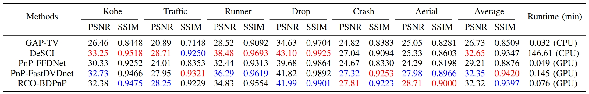

# [Efficient Plug-and-Play Algorithm for Video Snapshot Compressive Imaging and Optical Measurement Application](https://github.com/Qinmengxi/EfficientPnP)

## Network Architecture
<div align="center">
    
  
  Fig1. Schematic diagrams of video SCI system. The orange part represents hardware encoding, and the blue part denotes software decoding (implemented via PnP-based methods).
</div>

<div align="center">
    
  
  Fig2. Schematic diagrams of efficient binary deep plug-and-play algorithm with collaborative optimization for robust video SCI and applications.
</div>

<div align="center">
    
  
  Fig3. Architecture of the proposed BiFastDVDnet.
</div>

<div align="center">
  <table>
    <tr>
      <td>
        
        <p align="center">(a) Binary Convolution Unit Module.</p>
      </td>
      <td>
        
        <p align="center">(b) Forward and Backward.</p>
      </td>
    </tr>
  </table>
  Fig4. The network architecture of the proposed Regularized Binary Convolution Unit.
</div>

## 1. Installation
Please see the [environment](environment.yml) for RCO-BDPnP Installation. 
```
conda env create -f environment.yml
```

## 2. SCI Reconstruction
```
cd ./1_Reconstruction_Algorithm/
python main_grayscale_benchmark.py
```
### 2.1 Reconstruction quality on six simulated grayscale video SCI datasets 
<div align="center">
    
</div>

### 2.2 Visualization of reconstruction results on six simulated grayscale video SCI datasets
<div align="center">
    
</div>


## 3. Optical Measurement Application
### 3.1 Simulated optical measurement
(1) Reconstruction on simulated optical measurement

Firstly, navigate to the [1_Reconstruction_Algorithm](1_Reconstruction_Algorithm) folder and run [main_simulated_photomechanical_imaging.py](1_Reconstruction_Algorithm/main_simulated_photomechanical_imaging.py) to obtain the reconstructed speckle image sequence
```
cd ./1_Reconstruction_Algorithm/
python main_simulated_photomechanical_imaging.py
```
(2) DIC measurement and compute displacement error

Secondly, we use the [Ncorr algorithm](https://www.ncorr.com/) to calculate the displacement field of the reconstructed speckle image sequence and save the results in the [2_Simulated_Optical_Measurement/DIC-Result](2_Simulated_Optical_Measurement/DIC-Result) folder. Finally, navigate to the [2_Simulated_Optical_Measurement](2_Simulated_Optical_Measurement) directory and run the following .m files.
```
compute_pixerror.m
```
The computed displacement errors and corresponding displacement field visualization are illustrated in the figures below.
<div align="center">
    
</div>
<div align="center">
    
</div>

### 3.2 real optical measurement
(1) Reconstruction on simulated optical measurement

Navigate to the [1_Reconstruction_Algorithm](1_Reconstruction_Algorithm) folder and run [main_real_photomechanical_imaging.py](1_Reconstruction_Algorithm/main_real_photomechanical_imaging.py) to obtain the reconstructed speckle image sequence
```
cd ./1_Reconstruction_Algorithm/
python main_real_photomechanical_imaging.py
```

(2) Calibration

Enter the [1_calibration](3_Real_Optical_Measurement/1_calibration) folder and use the MATLAB toolbox to calibrate the camera parameters, then save them as [cameraParams.mat](3_Real_Optical_Measurement/1_calibration/cameraParams.mat).

(3) Data processing

Enter the [2_data_processing](3_Real_Optical_Measurement/2_data_processing) folder, place the reconstruction images into the data folder, and run the .m files to transform the images from the camera coordinate system to the tablet coordinate system. The transformed images will be saved in the resize_data folder.
```
boardimg.m
undistortedimg.m
resize_result.m
```

(4) DIC measurement and compute displacement error

We use the [Ncorr algorithm](https://www.ncorr.com/) to calculate the displacement field of the reconstructed speckle image sequence (In resize_data) and save the results in the [3_Real_Optical_Measurement/3_DIC-Result](3_Real_Optical_Measurement/3_DIC-Result) folder. Finally, navigate to the [3_Real_Optical_Measurement](3_Real_Optical_Measurement) directory and run the following .m files.
```
compute_error.m
```
The computed displacement errors and corresponding displacement field visualization are illustrated in the figures below.
<div align="center">
    
</div>
<div align="center">
    
</div>